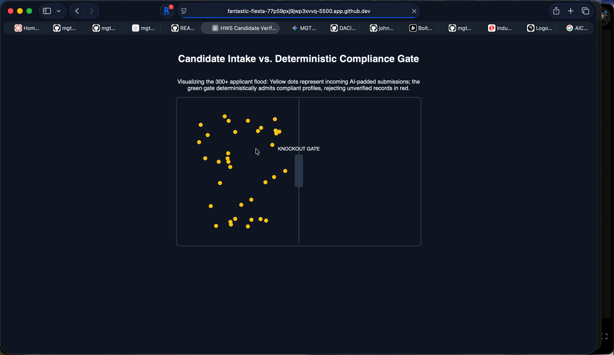

# HW5: Candidate Verification Gate Visualization (5B Medium)

## The Decision Document
See [docs/BRIEF.md](docs/BRIEF.md).

## See It Work
- **Live Preview:** Open `index.html` in a web browser.
- **Visual Demo:** The p5.js canvas visualizes 300+ applicant influx (yellow), deterministic knockout gate evaluation (center), passing eligible candidates (green), and falling ineligible submissions (red).

## Deliverables
- [docs/BRIEF.md](docs/BRIEF.md)
- [docs/JUDGMENT.md](docs/JUDGMENT.md)
- [docs/DDR-001.md](docs/DDR-001.md)
- [context/SKILLS.md](context/SKILLS.md)