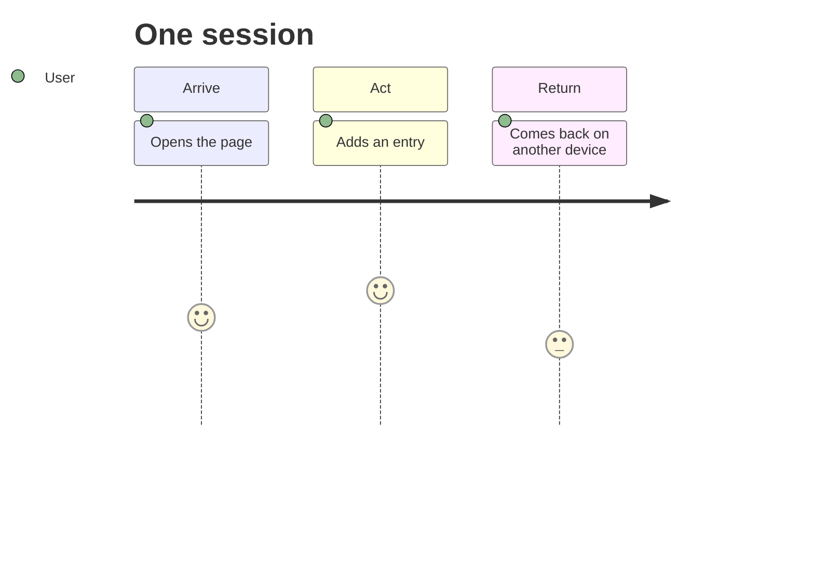

# USERS.md

Status: ACTIVE.

## Interview synthesis

### INT-01
I spoke with a recruiter responsible for filling engineering roles across Tier-1 automotive supplier manufacturing facilities across the eastern side of the US. He said he handles 500–800 applications per posting. What surprised me first was that he deliberately rejects automated ATS match scores and said he tries to read every resume that comes through. Because of his perspective as an underrepresented minority in corporate recruiting, he doesn't trust the platform's algorithmic rankings and commits to manually scanning every eligible application to surface non-traditional and minority candidates who are typically disadvantaged by standard recruiting filters. Second, his manual review is pretty quick, spending only 15 to 30 seconds per resume and completely ignoring summary statements and the skills sections at the bottom. He prioritizes looking almost exclusively at practical project bullets for revelant manufacturing verbs, project ownership, and detailed execution. Third, Workday, which is the software they use to recieve applications, is so poorly adapted for this rapid manual workflow that he abandons its tools entirely, instead maintaining an off-platform Excel tracker and manually organizing downloaded PDFs into local folders by technical discipline.

### INT-02
I spoke with an undergraduate business student currently applying for full-time roles to understand their application pipeline. What surprised me first was that despite popular assumptions that students feel detached or alienated from thier experience when using LLMs like ChatGPT or Gemini to rewrite their resumes, this student felt the AI tools genuinely enhanced their authentic voice and helped them map their skills to job postings rather than making them sound artificial. Second, their primary friction when applying was not formatting errors or tailoring technical vocabulary, but overall system-level redundancy, specifically having to repeatedly create new, isolated Workday accounts for every single employer portal while answering identical repetitive intake questions. Third, when asked what would make them feel like their application was fairly reviewed, they did not ask for deep automated scoring. They simply wanted transparency on application timelines, like an estimated date for when review cycles close or when initial interview invites roll out, so they are not left waiting and randomly receiving rejection emails.

## Two job statements
JOB-01: When I receive hundreds of entry-level engineering applications for an open role, I want to quickly identify and extract verified hands-on fabrication and design evidence from candidate projects, so I can present a defensible, diverse shortlist to skeptical hiring managers without being slowed down by clunky ATS interfaces or untrustworthy keyword scores.

JOB-02: When I find a job posting that aligns with my qualifications, I want to submit a tailored application without repetitive data entry and receive an upfront review timeline, so I know my materials were considered within an active hiring window instead of waiting aimlessly

## Two user profiles
PROFILE-01: The High-Volume, Diversity-Conscious Recruiter

**Situation:** Managing prospective employee pipelines for technical seating and plant engineering roles, going through 500–800 submissions per posting under strict requisition fill deadlines.

**Job Hiring For:** Rapidly identify and build a defensible shortlist of 15–20 candidates with genuine hands-on engineering aptitude without relying on algorithmic rankings or getting slowed down by software interfaces.

**Today's Approach:** 
* Uses automated ATS knockout rules solely for operational constraints like graduation dates, work authorization, and relocation consent.
* Manually opens each eligible PDF in Workday, spending 15–25 seconds scanning the Projects and Work Experience sections while bypassing the summary and skills lists.
* Exports applicant rows into an external Excel spreadsheet to track notes, manually downloading and grouping promising PDFs into local desktop folders by technical focus.
* Personally extracts specific project evidence from bullet points to justify non-traditional and minority candidates when presenting them to hiring managers.

**Why Today's Approach is Unsatisfying:** 
* The manual process is exhausting and breaks down entirely when volume exceeds 500+ applications.
* The native ATS document viewer in Workday is slow, requires multiple clicks per applicant, and frequently corrupts document layout.
* The software's native match score penalizes authentic candidates who describe hands-on fabrication without copying exact corporate job description keywords, forcing the recruiter to do double the manual administrative labor off-platform.

*Known vs. Assumed:**
* *Known:* Receives 500–800 applications per open role and relies strictly on hard knockout questions (work authorization, graduation year, relocation) before manual searching.
* *Known:* Actively inspects applications manually to counter systemic disadvantages faced by minority applicants and distrusts high ATS keyword match scores.
* *Known:* Spends 15–30 seconds per resume and looks specifically for physical execution verbs and project ownership rather than skills lists.
* *Known:* Abandons native ATS shortlisting to run an off-platform workflow of Excel trackers and local file folders.
* *Known:* Hiring managers push back on candidates who lack proven day-one shop/CAD literacy, requiring the recruiter to provide concrete project evidence.
* *Assumed:* The recruiter would trust a system that automatically surfaces contextual execution evidence without obscuring applicant demographics during the final review.
* *Assumed:* The recruiter is willing to upload batch resume exports into a secondary tool if it cuts manual scan time from 20 seconds down to under 5 seconds per candidate.

PROFILE-02: The Proactive Business Applicant

**Situation:** Active undergraduate business student monitoring job alerts, researching target employers, and tailoring applications to specific technical job descriptions while balancing coursework.

**Job Hiring For:** Efficiently deliver verified technical qualifications directly to a human decision-maker and obtain clear timing expectations for the interview screening cycle.

**Today's Approach:** 
* Sets up email alerts for target companies and reviews descriptions to evaluate qualifications.
* Uses LLMs like ChatGPT and Gemini to compare project bullets against job requirements and enhance vocabulary to match the posting.
* Researches employee interview experiences on Reddit to anticipate hiring procedures.
* Attempts to identify and message recruiters or hiring managers directly on LinkedIn before or after submitting.
* Manually creates accounts across dozens of corporate ATS portals and re-enters application data.

**Why Today's Approach is Unsatisfying:** 
* Massive administrative overhead from creating multiple siloed company portal accounts and answering repetitive intake prompts.
* No actual response following the automated "application received" confirmation emails leaves candidates with zero visibility into whether the role vacancy is active or already filled.
* Candidates lack timeline clarity, leaving them waiting aimlessly without knowing when interview calls will occur.

**Known vs. Assumed:**
* *Known:* Uses Gemini and ChatGPT intentionally to tailor resumes and believes LLMs enhance rather than compromise their voice.
* *Known:* Cross-references Reddit to understand employer hiring processes and actively searches LinkedIn to message recruiters and hiring managers.
* *Known:* Experiences major frustration with creating multiple Workday accounts and answering repetitive application questions.
* *Known:* Identifies prolonged post-submission radio silence and a lack of clear timeline estimates as the primary source of application anxiety.
* *Assumed:* The student would prefer a direct review-window timeline over an algorithmic match score if given the choice.
* *Assumed:* The student's LinkedIn outreach to corporate recruiters is largely unreturned due to recruiter volume constraints.

## Journey

